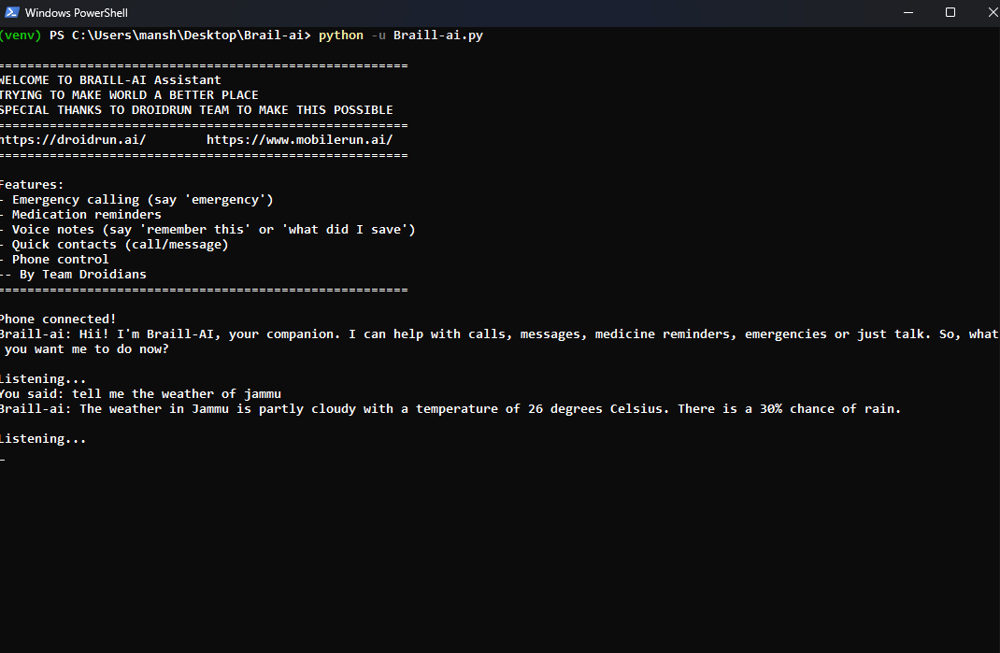
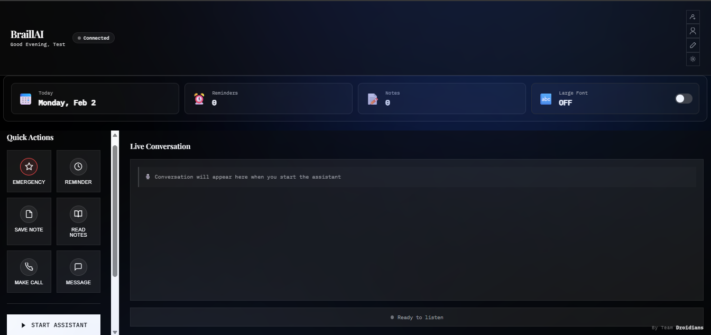
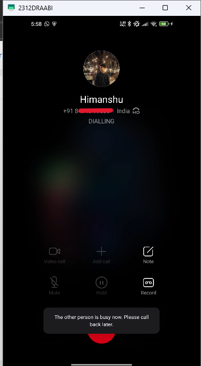
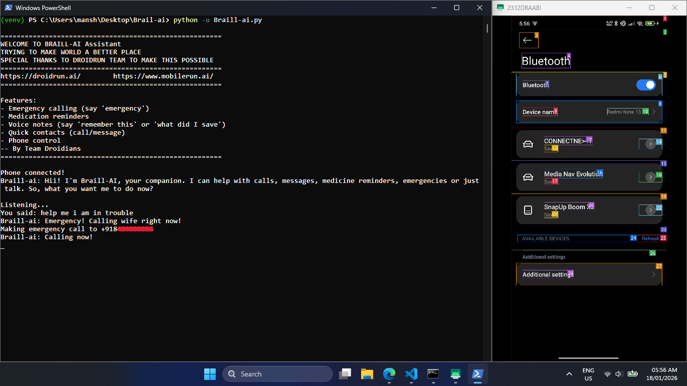
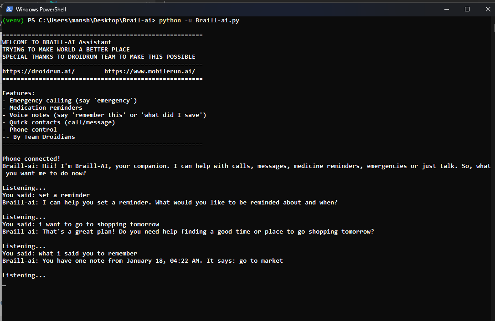
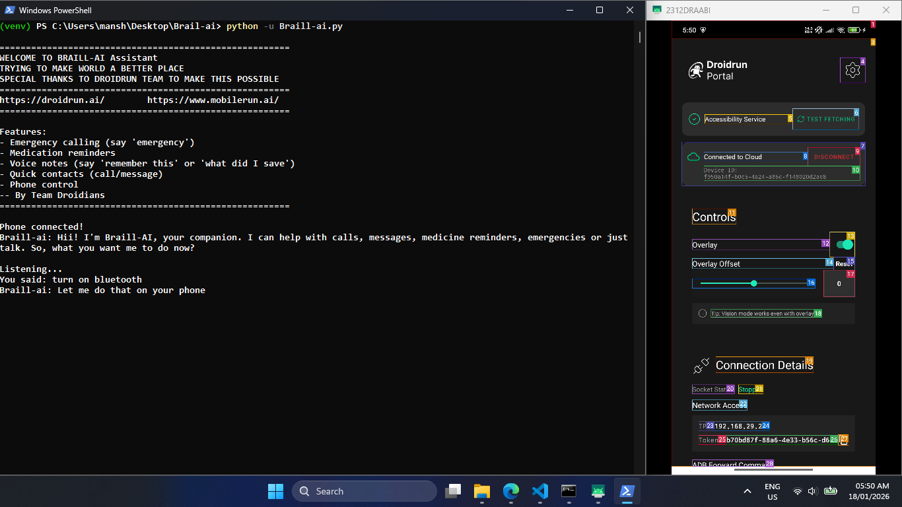
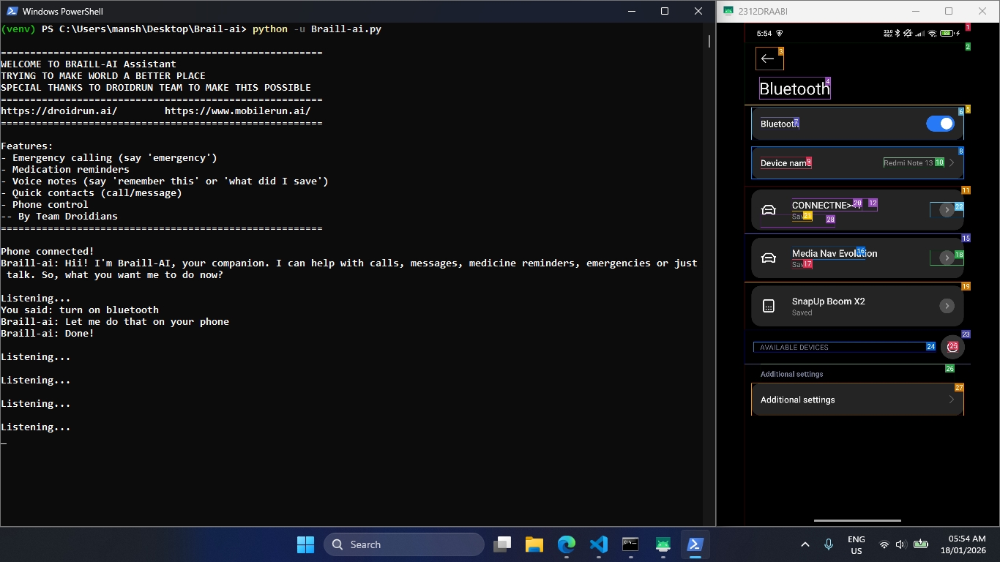
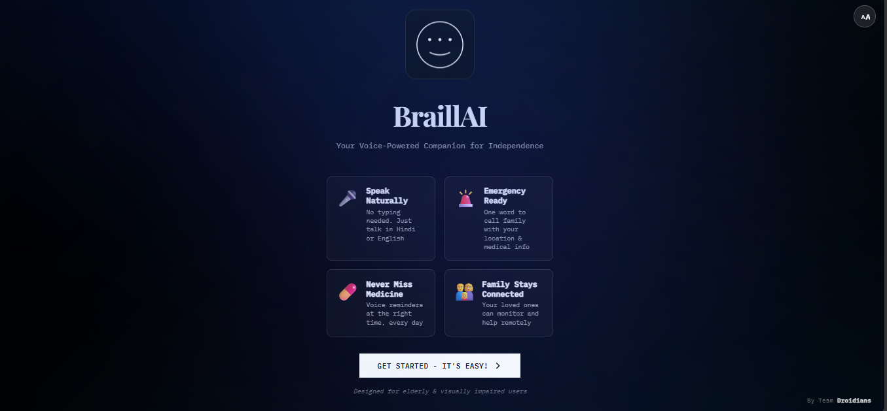

# 🤖 Braill-AI v2.0 (Hackathon Round 2)

> **A voice assistant for elderly and visually impaired people**  
> Now with a **web interface** so families can help too!  
> Built for **Droidrun DevSprint 2026** by 3 first-year students

---

## 💡 How We Named "Braill-AI"

The name **Braill-AI** is inspired by the **Braille system**, which is used by visually impaired people to read and understand text through touch.

Just like Braille helps blind people access information, our project aims to help visually impaired and elderly users access and control their smartphones through **voice instead of vision**.

So, *Braille + AI = Braill-AI* — a smart assistant designed for accessibility and independence.

---

## 📺 Watch Braill-AI in Action

| Introduction | Live Demo |
|-------------|-----------|
| <a href="https://www.youtube.com/watch?v=hkN6ZqNRZ78"></a> | <a href="https://youtu.be/mRNr_SIawlk"></a> |

---

## 🆕 What's New in v2? (Round 2 Update)

We took feedback from Round 1 and made it **way better**!

### Before (v1)
- ❌ Terminal only (scary for non-tech people)
- ❌ English only
- ❌ Hard to setup (edit code manually)
- ❌ No way for family to help remotely
- ❌ Echo problems sometimes

### Now (v2)
- ✅ **Web interface** - just open in browser!
- ✅ **Hindi + English** - bilingual support
- ✅ **Big buttons** - easy for elderly to click
- ✅ **Emergency alerts** - shows your medical info
- ✅ **Family can monitor** - see what's happening remotely
- ✅ **Better voice recognition** - using Whisper AI
- ✅ **Real-time updates** - see terminal output live
- ✅ **Much easier setup** - no coding needed

<p align="center">
  
  
</p>
<p align="center"><em>v1 Terminal Interface vs v2 Web Interface</em></p>

---

## 🚩 Problem We Tried to Solve

Many elderly and blind users face problems like:

* They can't see small text
* They don't understand smartphone buttons
* They forget medicines
* They panic in emergencies
* They find it hard to call people
* Family can't help them from far away

So we made **Braill-AI** to help them using voice + simple web interface.

---

## ✅ What Braill-AI Can Do

### 🚨 Emergency Help (UPGRADED!)

**Say:** "Emergency" or "Help" or "मदद"

**What happens:**
1. It calls a saved emergency contact
2. It also sends an emergency SMS
3. **NEW:** Shows your medical profile on screen (blood type, address, medications)
4. **NEW:** Family monitoring the web dashboard sees the alert
5. Very useful if the user is alone

<p align="center">
  
  
</p>

---

### 💊 Medicine Reminder (WITH DASHBOARD!)

**Say:** "Remind me to take medicine at 8 AM"

Then Braill-AI will:
* Save the reminder
* Speak an alert at the right time every day
* **NEW:** Show all reminders on web dashboard
* **NEW:** Delete reminders with one click

<p align="center">
  
</p>

---

### 📝 Voice Notes (Memory)

**Say:**
* "Remember this…"
* "What did I save?"
* "Delete my notes"

This helps people who forget things easily.

**NEW in v2:** View all notes in web interface too!

---

### 📞 Calling & Messaging (NOW WITH BUTTONS!)

**Say:**
* "Call mom"
* "Message doctor"
* "Text sister"

**NEW:** You can also click big buttons on the website - no voice needed!

Braill-AI will do it automatically using **mobilerun-sdk**.

---

### 🗣️ Hindi Language Support (NEW!)

Now works in both Hindi and English!

**English commands:**
* "Hello"
* "What time is it?"
* "Call mom"

**Hindi commands:**
* "नमस्ते" (Hello)
* "समय क्या है?" (What time is it?)
* "मॉम को कॉल करो" (Call mom)
* "मदद" (Help/Emergency)

Great for people who are more comfortable in Hindi!

---

### 📱 Phone Control using mobilerun-sdk

This is the cool part 😎

You can say things like:

* "Open WhatsApp"
* "Search hospitals"
* "Open Google Maps"
* "Take a photo"
* "Find restaurants"
* "Turn on Bluetooth"

Braill-AI sends these commands to **mobilerun-sdk Cloud**, which controls your real phone automatically.

So even if the user can't see the screen, the phone still works.

<p align="center">
  
  <br>
  
</p>

---

### 🌐 Web Dashboard (NEW!)

The biggest addition - now there's a web interface!

**Features:**
* Big start/stop buttons
* Quick action buttons (emergency, reminder, notes)
* Contact list with call/message buttons
* Real-time terminal output streaming
* Settings page for API keys
* Text size adjustment (for better visibility)
* Emergency profile display

**How to use:**
1. Start the server: `python web_app.py`
2. Open browser: `http://localhost:5000`
3. That's it! 😊

**Why it's helpful:**
* Family can monitor from anywhere
* Easy to add contacts (no coding!)
* See all reminders in one place
* Emergency alerts visible on screen
* Much less scary than terminal

---

## 🧠 AI Used

We used **Google Gemini AI** so Braill-AI can understand normal human language like:

* "What time is it?"
* "How are you?"
* "Where is the nearest hospital?"

If Gemini is not working, Braill-AI still gives basic answers.

---

## 🛠️ Technologies Used

### v2 Tech Stack (Upgraded!)

| Component     | v1 (Round 1)              | v2 (Round 2)                    |
| ------------- | ------------------------- | ------------------------------- |
| Language      | Python                    | Python + HTML/CSS/JS            |
| Web Framework | None                      | **Flask + Socket.IO**           |
| Phone Control | Droidrun + mobilerun-sdk  | Droidrun + mobilerun-sdk        |
| AI            | Google Gemini             | Google Gemini                   |
| Speech Input  | Google Speech Recognition | **Whisper + Google SR**         |
| Voice Output  | pyttsx3 (offline TTS)     | **gTTS (better quality)**       |
| Languages     | English only              | **English + Hindi**             |
| Interface     | Terminal only             | **Web Interface + Terminal**    |
| Real-time     | None                      | **WebSocket (live updates)**    |

---

## 🗝️ How It Works

### Architecture Diagram

```
User speaks → Speech Recognition → AI Processing → Action Execution
                                        ↓
   
                           ┌────────────┴────────────┐
                           │                         │
                      Gemini AI              mobilerun-sdk Cloud
                    (Conversation)          (Phone Control)
                           │                         │
                           └────────────┬────────────┘
                                        ↓
                              Text-to-Speech Response
```

### v2 Detailed Flow (NEW!)

```
┌─────────────────────────────────────────────────────────────┐
│                      USER INTERACTION                       │
│                                                             │
│    Voice Input (Mic)          Web Browser (Dashboard)      │
│           │                              │                 │
└───────────┼──────────────────────────────┼─────────────────┘
            │                              │
            ▼                              ▼
┌─────────────────────────────────────────────────────────────┐
│                   FLASK WEB SERVER                          │
│              (WebSocket + API Endpoints)                    │
└───────────┬──────────────────────────────┬──────────────────┘
            │                              │
            ▼                              ▼
┌─────────────────────┐        ┌─────────────────────────────┐
│  Whisper/Google SR  │        │    JSON Data Storage        │
│  (Speech to Text)   │        │ (Reminders/Notes/Contacts)  │
└──────────┬──────────┘        └─────────────────────────────┘
           │
           ▼
┌─────────────────────────────────────────────────────────────┐
│                      Gemini AI                              │
│              (Process & Understand)                         │
└───────────┬──────────────────────────────┬──────────────────┘
            │                              │
            ▼                              ▼
┌─────────────────────┐        ┌─────────────────────────────┐
│   gTTS/pyttsx3      │        │    mobilerun-sdk API        │
│ (Text to Speech)    │        │   (Phone Control)           │
└─────────────────────┘        └─────────────────────────────┘
```

---

## 📸 Application Screenshots

### v1 Screenshots (Round 1)

<p align="center">
  
  
</p>
<p align="center"><em>Braill-AI v1 startup and voice listening mode</em></p>

### v2 Screenshots (Round 2 - NEW!)

<p align="center">
  
  
</p>
<p align="center"><em>v2 Welcome Screen and Dashboard with real-time updates</em></p>

---

## 📦 How to Run This Project

### Step 1: Make virtual envronment and Install packages (Please Use Powershell with python 3 or above on Windows)

```bash
python -m venv braill_env 
```

```bash
braill_env\Scripts\activate
```

```bash
pip install flask flask-socketio openai-whisper SpeechRecognition google-genai gTTS pyttsx3 mobilerun-sdk sounddevice pygame numpy python-socketio
```

Or use requirements.txt:

```bash
pip install -r requirements.txt
```

### Step 2: Add your keys

**Option 1: Using Web Interface (Easiest!)**

1. Start server: `python web_app.py`
2. Open browser: `http://localhost:5000`
3. Click "Get Started" → "Configure APIs"
4. Fill in your API keys:
   - Gemini API Key
   - mobilerun-sdk Key (optional)
   - Device ID (optional)
5. Click "Save Configuration"
6. Done! 🎉

**Option 2: Create .env file**

Create a file named `.env` in the project folder:

```env
GEMINI_API_KEY=your_gemini_key_here
MOBILERUN_KEY=your_mobilerun_key_here
DEVICE_ID=your_device_id_here
```

**Where to get keys:**
* **Gemini API:** https://aistudio.google.com/api-keys (free)
* **mobilerun-sdk:** https://mobilerun.cloud (free trial available)

### Step 3: Run

**For web interface (Recommended!):**
```bash
python web_app.py
```

Then open `http://localhost:5000` in your browser.

**For terminal only (old way):**
```bash
python braill-ai.py
```

Then just start speaking 😊

---

## 🎬 Example Commands

Try saying:

**General:**
* "Hello"
* "What time is it?"
* "How are you?"

**Emergency:**
* "Emergency"
* "Help"
* "मदद" (Hindi)

**Reminders:**
* "Remind me to take medicine at 8 AM"
* "What are my reminders?"

**Notes:**
* "Remember this: Doctor appointment on Friday"
* "What did I save?"
* "Read my notes"

**Calling:**
* "Call mom"
* "Message doctor"
* "Text sister"

**Phone Control (via mobilerun-sdk):**
* "Open WhatsApp"
* "Search hospitals near me"
* "Turn on Bluetooth"
* "Take a photo"

**Hindi:**
* "नमस्ते" (Hello)
* "समय क्या है?" (What time)
* "डॉक्टर को कॉल करो" (Call doctor)

---

## 🐛 Common Issues

**"Phone not connected"**
* Don't worry! This is normal if you don't have mobilerun-sdk setup
* Voice, reminders, and notes still work fine
* Only phone control features are disabled

**"Can't hear me"**
* Check microphone permissions in system settings
* Speak clearly and not too fast
* Reduce background noise
* Make sure you're not too far from mic

**"Hindi not working"**
* Select "Hindi" when it asks for language at startup
* Hindi needs internet connection (uses Google SR)
* Speak clearly in Hindi

**"Echo / hearing own voice"**
* We fixed most of this in v2 with better filtering!
* If still happening: use headphones
* Or reduce speaker volume

**"Port 5000 already in use"**
* Change port in last line of `web_app.py`: `socketio.run(app, port=5001)`
* Or stop other app using port 5000

**"Whisper taking too long to load"**
* First time is slow (downloading model)
* After that it's fast
* Using "base" model for good speed/accuracy balance

---

## 🚀 Future Ideas (If We Get Time)

* Use camera to describe objects
* Read text from images (OCR)
* Identify money notes
* Detect falls using phone sensors
* Share live location in emergencies
* Support more languages (Tamil, Telugu, Bengali, Marathi)
* Mobile app version (React Native)
* Offline mode for basic features

But honestly, we're first-years and this already took forever 😅

---

## 👥 Team

Meet the **Team DROIDIANS**

* **Himanshu** – AI & backend, Gemini integration, Flask server, WebSocket
* **Debarghyaray** – Voice system, Whisper integration, audio processing, Hindi support
* **Samriddha** – mobilerun-sdk testing, user testing, bug finding and fixing, accessibility feedback

---

## 🏆 Hackathon

Built for **Droidrun DevSprint 2026**  
Track: **B2C Automation**  
Round: **2 (Advanced)**

### What We Learned in Round 2:
* How to build web interfaces with Flask
* WebSocket for real-time communication (Socket.IO)
* Better speech recognition (Whisper vs Google SR)
* Making accessible UIs (high contrast, big buttons, text sizing)
* Managing larger codebases (got messy but we survived!)
* Working under hackathon pressure
* Importance of user testing with actual elderly users

---

## 📊 v1 vs v2 Comparison

| Feature | v1 | v2 | Change |
|---------|----|----|--------|
| **Interface** | Terminal only | Web + Terminal | ✅ Much better |
| **Languages** | English | English + Hindi | ✅ +1 language |
| **Setup** | Edit code manually | Web form | ✅ Way easier |
| **Voice Input** | Google SR only | Whisper + Google SR | ✅ More accurate |
| **Voice Output** | pyttsx3 | gTTS | ✅ Better quality |
| **Emergency** | Call only | Call + SMS + Alert | ✅ Enhanced |
| **Monitoring** | None | Web dashboard | ✅ New feature |
| **Accessibility** | Basic | High (big buttons, contrast) | ✅ Much improved |
| **Real-time Updates** | None | WebSocket streaming | ✅ New |
| **Contact Management** | Edit code | Web UI | ✅ User-friendly |

---

## 📁 Project Structure

```
Braill-Ai/
├── web_app.py                 
├── braill-ai-V2.py           
├── requirements.txt          
├── .env                      
│
├── templates/
│   └── index.html           
│
├── static/
│   ├── css/
│   │   └── style.css       
│   ├── js/
│   │   └── app.js           
│   └── images/
│       └── logo_transparent.png
│
├── screenshots/             
│   ├── screenshot1-7.png    
│   └── v2_*.png             
│
├── reminders.json           
├── notes.json               
├── contacts.json             
└── user_profile.json         
```

It's not perfect but it works and helps people! 🎉

---

## ❤️ Thanks To

* **Droidrun Teamand IIT Patna GDGC Team** - For this amazing hackathon opportunity
* **mobilerun-sdk Team** - For the awesome phone control SDK
* **Stack Overflow** -  For saving us

---

**Made with love by TEAM DROIDIANS 🚀**

We're just 3 first-year students trying to make tech accessible for everyone!

---

## 🔗 Links

- **GitHub:** https://github.com/HimanshuIITP/Braill-Ai
- **v1 Demo Video:** https://www.youtube.com/watch?v=hkN6ZqNRZ78
- **v2 Demo Video:** https://youtu.be/mRNr_SIawlk

---

#DroidrunDevSprint #Accessibility #VoiceAI #MakingChange #FirstYearProject
