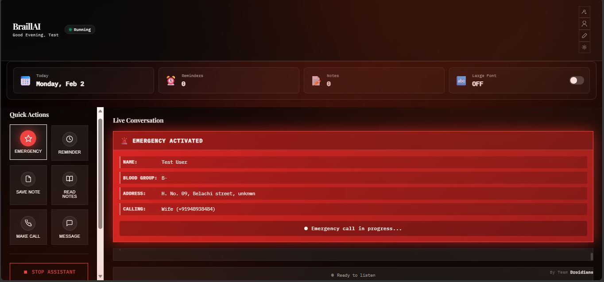
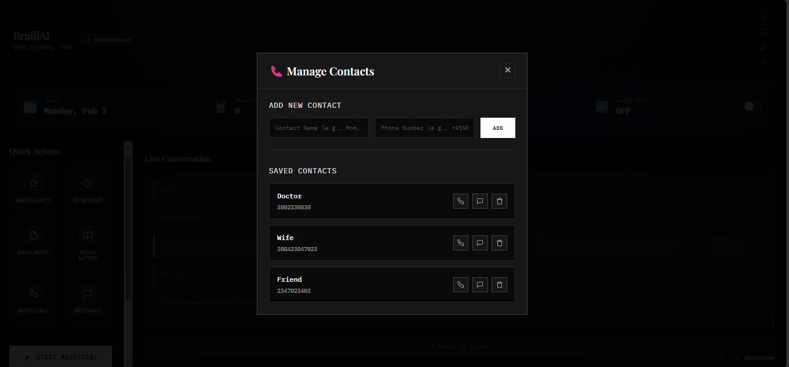

# 🤖 Braill-AI v2.0 (Hackathon Round 2)

> **A voice assistant for elderly and visually impaired people**  
> Now with a **web interface** so families can help too!  
> Built for **Droidrun DevSprint 2026** by 3 first-year students

---

## 💡 Why "Braill-AI"?

**Braille** helps blind people read through touch.  
**Braill-AI** helps them use smartphones through **voice**.

Simple idea, big impact 🙂

---

## 📺 Watch It Work

| v1 Demo (Round 1) | v2 Update (Round 2) |
|-------------------|---------------------|
| <a href="https://www.youtube.com/watch?v=hkN6ZqNRZ78"></a> | 🎥 *Coming soon* |

---

## 🆕 What's New in v2? (Round 2 Update)

We listened to feedback and made it way better!

### Before (v1)
- ❌ Terminal only (scary for non-tech people)
- ❌ English only
- ❌ Hard to setup (edit code manually)
- ❌ No way for family to help

### Now (v2)
- ✅ **Web interface** - just open in browser!
- ✅ **Hindi + English** - choose your language
- ✅ **Big buttons** - easy for elderly to click
- ✅ **Emergency alerts** - shows your medical info
- ✅ **Family can monitor** - see what's happening remotely
- ✅ **Much easier setup** - no coding needed

<p align="center">
  
  
</p>

---

## 🚩 The Problem We're Solving

Elderly and blind people can't use smartphones easily:

* Small text and buttons
* Don't understand apps
* Forget medicines
* Panic in emergencies
* Family can't help from far away

**Our solution:** Just speak, the phone listens and helps 🎤

---

## ✨ What It Can Do

### 🚨 Emergency Feature (NEW & IMPROVED!)

**Say:** "Emergency" or "Help" or "मदद"

**What happens:**
1. Calls your emergency contact
2. Sends SMS with your location
3. Shows your medical info on screen (blood type, address, etc.)
4. Family can see the alert if they're monitoring

This could save lives! 🚑

<p align="center">
  
  
</p>

---

### 💊 Medicine Reminders

**Say:** "Remind me to take medicine at 8 AM"

- It saves the reminder
- Speaks alert at the right time every day
- **NEW:** You can see all reminders on the website
- **NEW:** Delete reminders by clicking

<p align="center">
  
</p>

---

### 📝 Voice Notes

**Say:**
- "Remember this..."
- "What did I save?"
- "Read my notes"

Perfect for people who forget things!

---

### 📞 Calling & Messaging

**Say:**
- "Call mom"
- "Message doctor"

**NEW:** You can also just click big buttons on the website - no voice needed!

<p align="center">
  
</p>

---

### 🗣️ Hindi Support (NEW!)

Now works in Hindi too!

- "नमस्ते" - Hello
- "मदद" - Help/Emergency
- "समय क्या है?" - What time is it?
- "डॉक्टर को कॉल करो" - Call doctor

Great for people who don't speak English!

---

### 🌐 Web Dashboard (NEW!)

The biggest change - now there's a website!

**Why it's helpful:**
- Family can monitor from anywhere
- Easy to add contacts (no coding!)
- See all reminders in one place
- Big buttons for emergency/calling
- Adjust text size if needed

**How to use:**
1. Open `http://localhost:5000` in browser
2. That's it! 😊

---

## 📱 Phone Control (Coz Why Not!)

**Say:**
- "Open WhatsApp"
- "Search hospitals"
- "Open Maps"
- "Take a photo"

Uses **MobileRun** to control your real Android phone.

<p align="center">
  
</p>

---

## 🛠️ Tech We Used

| What | v1 | v2 (NEW!) |
|------|-------|-----------|
| Language | Python | Python + HTML/CSS/JS |
| Voice Input | Google SR | **Whisper + Google SR** |
| Voice Output | pyttsx3 | **gTTS (better quality)** |
| Interface | Terminal only | **Flask web server** |
| Real-time Updates | None | **Socket.IO** |
| Languages | English | **English + Hindi** |
| Phone Control | MobileRun | MobileRun |
| AI | Gemini | Gemini |

Basically we learned a LOT in Round 2! 😅

---

## 📦 How to Run --->

### step 1: Create python 3.13 virtual environment inside directory (Use Powershell)
```bash
python3.13 -m venv braill_env
```

### step 2: Activate the virtual environment
```bash
braill_env\Scripts\activate
```

### Step 2: Install stuff
```bash
pip install flask flask-socketio openai-whisper SpeechRecognition google-generativeai gTTS pyttsx3 mobilerun-sdk sounddevice pygame numpy
```

Or just:
```bash
pip install -r requirements.txt
```

### Step 3: Get API keys

**Gemini key** (free):
- Go to https://aistudio.google.com/api-keys
- Make an API key
- Copy it

**MobileRun key** (optional, if you want phone control):
- Go to https://mobilerun.ai
- Sign up
- Get key from their app

### Step 3: Start the server

```bash
python web_app.py
```

You'll see:
```
BraillAI Web Server Starting...
Open your browser and go to: http://localhost:5000
```

### Step 4: Open browser

Go to `http://localhost:5000` and fill in:
- Your API keys
- Your profile (name, blood type, emergency contact)
- Add some contacts

### Step 5: Start talking!

Click the big "Start Assistant" button and speak 🎤

---

## 🎬 Try These Commands

**English:**
- "Hello"
- "What time is it?"
- "Emergency"
- "Call mom"
- "Remind me to take medicine at 8 AM"

**Hindi:**
- "नमस्ते"
- "समय क्या है?"
- "मदद"
- "मॉम को कॉल करो"

---

## 📸 Screenshots

### Old Terminal Interface (v1)
<p align="center">
  
  
</p>

### New Web Interface (v2)
<p align="center">
  
  
</p>

---

## 🐛 Common Problems

**"Phone not connected"**
- That's okay! Phone features just won't work
- Everything else (calling, voice, reminders) works fine

**"Can't hear me"**
- Check microphone permissions
- Speak clearly
- Reduce background noise

**Hindi not working**
- Select "Hindi" when it asks
- Needs internet (uses Google)

**Port 5000 error**
- Change port in last line of `web_app.py`

---

## 🚀 What We Want to Add (If We Get Time)

- Use camera to read text
- Identify money notes
- Detect if person falls
- More languages (Tamil, Telugu)
- Mobile app version

But honestly, we're first-years and this took forever already 😅

---

## 👥 Our Team

**Team DROIDIANS** - 3 first-year engineering students:

* **Himanshu** – AI stuff, backend, Gemini integration
* **Debarghyaray** – Voice system, Whisper, fixing echo bugs
* **Samriddha** – MobileRun testing, user testing

We're learning as we go! 🎓

---

## 🏆 For Droidrun DevSprint 2026

**Track:** B2C Automation  
**Round:** 2 (Advanced)

### What we learned in Round 2:
- How to make web interfaces with Flask
- WebSocket for real-time stuff
- Better speech recognition (Whisper)
- Accessibility design (big buttons, high contrast)
- Working with AI APIs
- Juggling college + hackathon 😅

We're not trying to be perfect - we're trying to help real people who struggle with tech.

---

## ❤️ Thanks

* Droidrun team for this opportunity
* Our families who tested it
* MobileRun for the phone control API
* Google for free Gemini & Speech APIs
* Stack Overflow for saving us 100 times

---

## 📝 Files Structure

```
Braill-Ai/
├── web_app.py              # Main server (Flask)
├── braill_ai_modified.py   # Voice assistant logic
├── requirements.txt        # What to install
├── templates/
│   └── index.html         # Website
├── static/
│   ├── css/style.css      # Styling
│   └── js/app.js          # Frontend JS
└── screenshots/           # Pics for this README
```

It's not fancy but it works! 🎉

---

**Made by students, for people who need it 🚀**

#DroidrunDevSprint #Accessibility #FirstYearProject

---

## 🔗 Links

- **GitHub:** https://github.com/HimanshuIITP/Braill-Ai
- **v1 Demo:** https://www.youtube.com/watch?v=hkN6ZqNRZ78
- **v2 Demo:** Coming soon!

If you like this, give us a ⭐ on GitHub!
