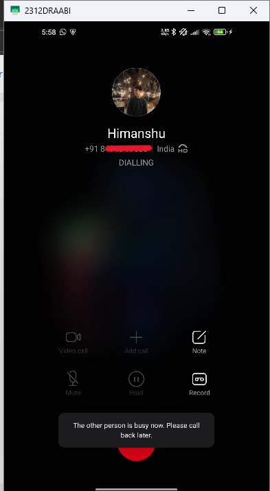
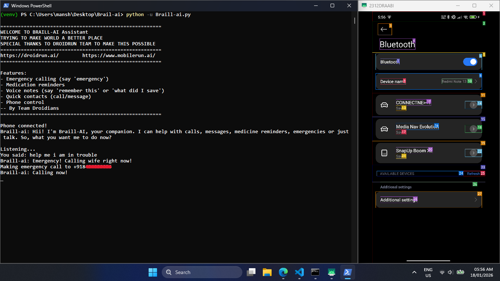
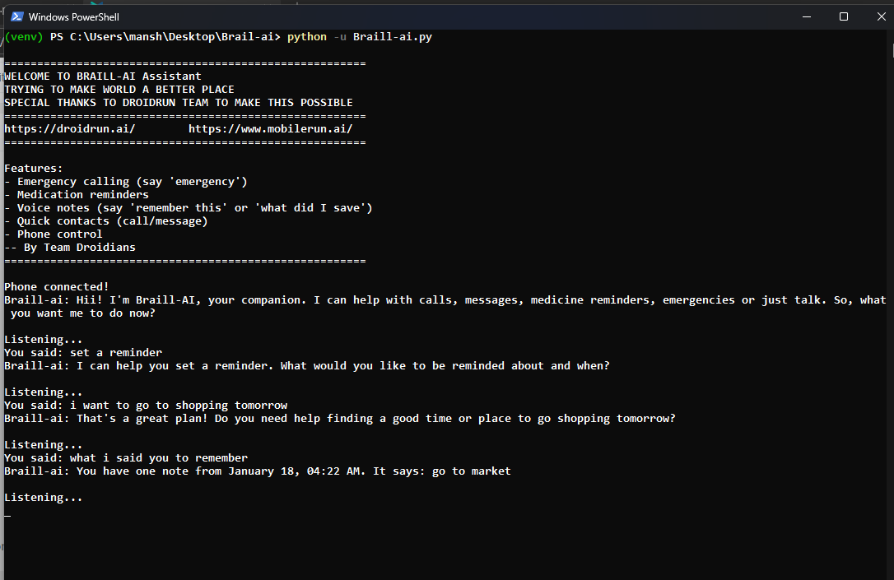
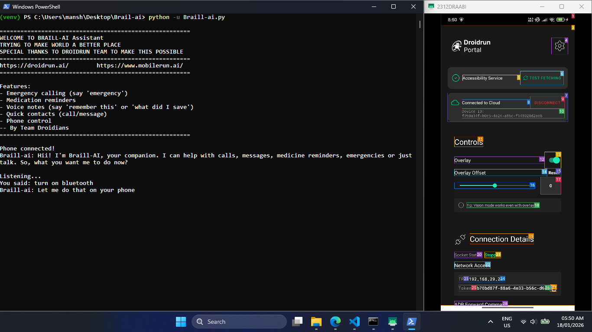
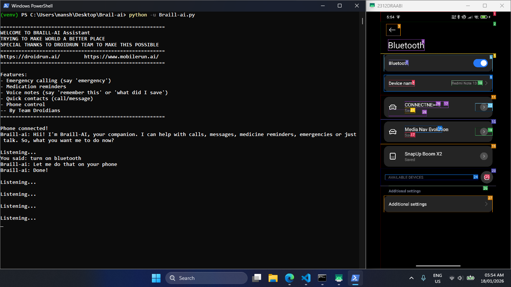
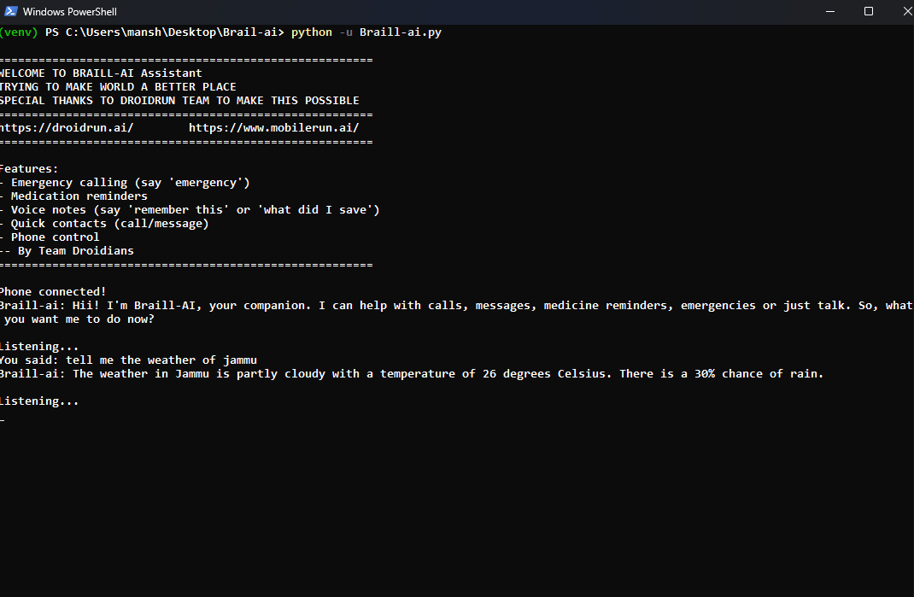
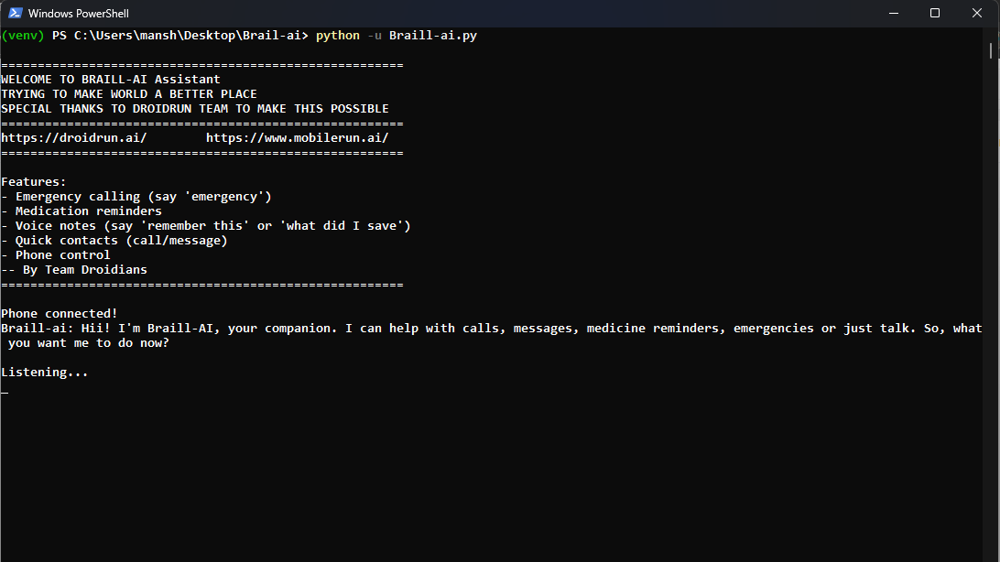

# 🤖 Braill-AI (Hackathon Project)

> **A simple voice assistant for elderly and visually impaired people**
> Built using **Python + Droidrun + MobileRun Cloud** for **Droidrun DevSprint 2026**

---

## 💡 How We Named "Braill-AI"

The name **Braill-AI** is inspired by the **Braille system**, which is used by visually impaired people to read and understand text through touch.

Just like Braille helps blind people access information, our project aims to help visually impaired and elderly users access and control their smartphones through **voice instead of vision**.

So, *Braille + AI = Braill-AI* — a smart assistant designed for accessibility and independence.

---

## ❓ What is this project?

Braill-AI is a **voice-based assistant** that helps elderly and visually impaired users use their Android phone **without touching the screen**.

Instead of clicking buttons, they can just **speak** and the phone will respond and take action.

This is a **student hackathon project**, so the code is simple and beginner-friendly.

---

## 📺 Watch Braill-AI in Action

| Introduction | Live Demo |
|-------------|-----------|
| <a href="https://www.youtube.com/watch?v=hkN6ZqNRZ78"></a> | <a href="https://youtu.be/mRNr_SIawlk"></a> |


## 🚩 Problem We Tried to Solve

Many elderly and blind users face problems like:

* They can't see small text
* They don't understand smartphone buttons
* They forget medicines
* They panic in emergencies
* They find it hard to call people

So we made **Braill-AI** to help them using only voice.

---

## ✅ What Braill-AI Can Do

### 🚨 Emergency Help

Say:

> "Emergency" or "Help"

What happens:

* It calls a saved emergency contact
* It also sends an emergency SMS
* Very useful if the user is alone

<p align="center">
  
  
</p>

---

### 💊 Medicine Reminder

Say:

> "Remind me to take medicine at 8 AM"

Then Braill-AI will:

* Save the reminder
* Speak an alert at the right time every day

---

### 📝 Voice Notes (Memory)

Say:

* "Remember this…"
* "What did I save?"
* "Delete my notes"

This helps people who forget things easily.

<p align="center">
  
</p>

---

### 📞 Calling & Messaging

Say:

* "Call mom"
* "Message doctor"
* "Text sister"

Braill-AI will do it automatically using **MobileRun**.

---

## 📱 Phone Control using MobileRun

This is the cool part 😎

You can say things like:

* "Open WhatsApp"
* "Search hospitals"
* "Open Google Maps"
* "Take a photo"
* "Find restaurants"

Braill-AI sends these commands to **MobileRun Cloud**, which controls your real phone automatically.

So even if the user can't see the screen, the phone still works.

<p align="center">
  
  <br>
  
</p>

---

## 🧠 AI Used

We used **Google Gemini AI** so Braill-AI can understand normal human language like:

* "What time is it?"
* "How are you?"
* "Where is the nearest hospital?"

If Gemini is not working, Braill-AI still gives basic answers.

---

## 🛠️ Technologies Used

| Thing         | What We Used              |
| ------------- | ------------------------- |
| Language      | Python                    |
| Phone Control | Droidrun + MobileRun      |
| AI            | Google Gemini             |
| Speech Input  | Google Speech Recognition |
| Voice Output  | pyttsx3 (offline TTS)     |

---

## 🗝️ How It Works

```
User speaks → Speech Recognition → AI Processing → Action Execution
                                        ↓
   
                           ┌────────────┴────────────┐
                           │                         │
                      Gemini AI              MobileRun Cloud
                    (Conversation)          (Phone Control)
                           │                         │
                           └────────────┬────────────┘
                                        ↓
                              Text-to-Speech Response
```

### 📸 Application Screenshots

<p align="center">
  
  
</p>
<p align="center"><em>Braill-AI startup and voice listening mode</em></p>

---

## 📦 How to Run This Project

### Step 1: Install packages

```bash
pip install speechrecognition requests mobilerun pyttsx3 google-generativeai
```

### Step 2: Add your keys in code

Change these in the file:

```python
GEMINI_KEY = "your_gemini_key"
MOBILERUN_KEY = "your_mobilerun_key"
DEVICE_ID = "your_device_id"
```

### Step 3: Run

```bash
python braill_ai.py
```

Then just start speaking 😊

---

## 🎬 Example Commands

Try saying:

* "Emergency"
* "Remind me to take medicine at 8 AM"
* "Remember this"
* "Call mom"
* "Open WhatsApp"
* "What time is it?"

---

## 🚀 Future Ideas (if we get time)

* Use camera to describe objects
* Read text from images
* Identify money notes
* Detect falls
* Share live location
* Support Hindi + other languages

---

## 👥 Team

We are **3 first-year students** learning AI and Python:

* Himanshu – AI & backend
* Debarghyaray – Voice system
* Samriddha – MobileRun testing

---

## 🏆 Hackathon

Built for **Droidrun DevSprint 2026**
Track: **B2C Automation**

We made this to help real people, not just for marks 🙂

---

## ❤️ Thanks To

* Droidrun Team
* MobileRun Cloud
* Google Gemini

---

**Made with love by DROIDIANS 🚀**

#DroidrunDevSprint #Accessibility #VoiceAI #MakingChange
